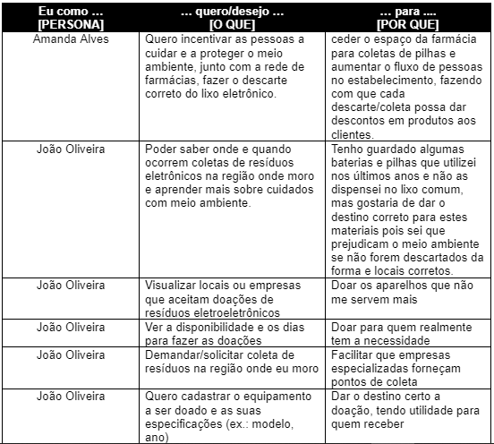

# Especificações do Projeto

A definição exata do problema e os pontos mais relevantes a serem tratados neste projeto foram consolidadas com a participação dos usuários em um trabalho de imersão feito pelos membros da equipe a partir da observação dos usuários em seu local natural e por meio de entrevistas. Os detalhes levantados nesse processo foram consolidados na forma de personas e histórias de usuários.

## Personas

As personas levantadas durante o processo de entendimento do problema são apresentadas na Figuras que se seguem.

Amanda Alves tem 41 anos, é gerente de farmácia na região metropolitana de Belo Horizonte.

Carlos Nogueira tem 41 anos, é Diretor de escola pública da região metropolina de Belo Horizonte.

Leonardo Soares tem 45 anos, é casado e empresário do ramo da tecnologia da região metropolitana de Belo Horizonte.

João Oliveira tem 31 anos, é comerciante e morador de Belo Horizonte.

Ana Silveira tem 29 anos, é Secretária Municipal de Meio Ambiente da cidade de Belo Horizonte.

## Histórias de Usuários

A partir da compreensão do dia a dia das personas identificadas para o projeto, foram registradas as seguintes histórias de usuários.

## Requisitos

O escopo funcional do projeto é definido por meio dos requisitos funcionais que descrevem as possibilidades de interação dos usuários, bem como os requisitos não funcionais que descrevem os aspectos que o sistema deverá apresentar de maneira geral. Estes requisitos são apresentados a seguir.

### Requisitos Funcionais

A tabela a seguir apresenta os requisitos do projeto, identificando a prioridade em que os mesmos devem ser entregues.

### Requisitos não Funcionais

A tabela a seguir apresenta os requisitos não funcionais que o projeto deverá atender.

## Restrições

As questões que limitam a execução desse projeto e que se configuram como obrigações claras para o desenvolvimento do projeto em questão são apresentadas na tabela a seguir.

